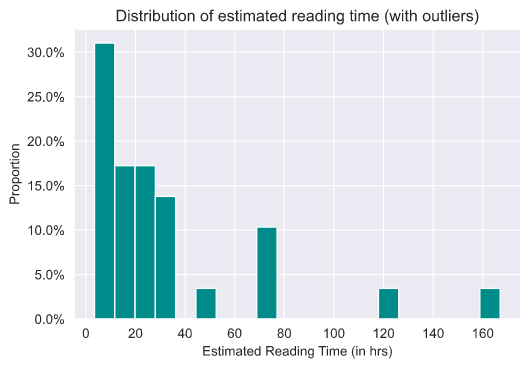
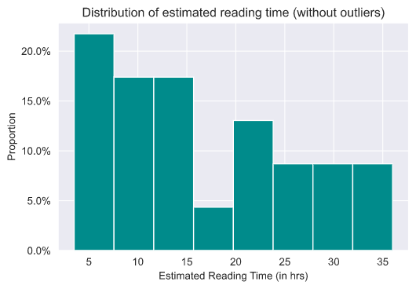

# Wisdom of the crowd
An amateurish attempt at replicating wisdom of the crowd experiment. Subjects were asked to estimate reading time of Death Note All in one Edition. Grateful to the participants for participating in the experiment. 
Actual reading time = **13.947 hours** (13 hours 56 minutes and 50s)
## 1. Analysis of estimates (the dataset has around 5-6 outliers)

Distribution of the dataset - 

Mean estimate = **31.496 hrs**

Median estimate = **20.000 hrs**

## 2. Analysis of estimates (outliers have been dropped)

Distribution of the dataset - 

Mean estimate = **15.756 hrs**

Median estimate = **12.000 hrs**
